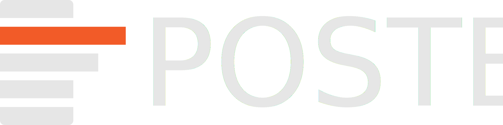

---
hide:
  - navigation
  - toc
---

  
  

# POSTED: Potsdam Open-Source Techno-Economic Database

POSTED stands for **Potsdam Open-Source Techno-Economic Database**. It is pronounced the same way as the English word [posted](https://dictionary.cambridge.org/pronunciation/english/posted) /ˈpəʊs.tɪd/.

POSTED is a public database of techno-economic data on energy and climate-mitigation technologies and a framework for consistent handling of this database.

-   :material-book-open-variant:{ .lg .middle } __User Guide__

    ---

    Understand the basic concepts of POSTED.

    [:octicons-arrow-right-24: Read documentation](guide/overview.md)

-   :material-database:{ .lg .middle } __Database__

    ---

    Look at the data currently available in the database.

    [:octicons-arrow-right-24: Look at the data](data/index.md)

-   :material-file-code:{ .lg .middle } __API Reference__

    ---

    Inspect the functions and classes of the POSTED framework written in Python.

    [:octicons-arrow-right-24: Read the code docs](api/index.md)

## Credits and Thanks

* The software creation and data curation have been primarily conducted at the [Potsdam Institute for Climate Impact Research (PIK)](https://www.pik-potsdam.de/), a German research institute conducting integrated research for global sustainability.
* This work has been completed as part of the Ariadne project with funding from the German Federal Ministry of Research, Technology and Space (grant nos. 03SFK5A, 03SFK5A0-2).
* The software code has been written by P.C. Verpoort, with support by L. Heidweiler and P. Effing.
* The data has been curated primarily by P.C. Verpoort, with many valuable contributions by other colleagues from PIK (see [`CITATION.cff`](https://github.com/PhilippVerpoort/posted/blob/main/CITATION.cff) for a full list).

## How to cite

* To cite a release (recommended), please refer to a specific version archived on [Zenodo](https://zenodo.org/doi/10.5281/zenodo.10639752).
* To cite a specific commit, please refer to the citation information in [`CITATION.cff`](https://github.com/PhilippVerpoort/posted/blob/main/CITATION.cff) and include the commit hash.
* In addition to citing this database, you may also want to cite the original sources. Bibliographic information for individual sources can be found under [Sources](sources.md) or in the BibTeX file [`sources.bib`](https://github.com/PhilippVerpoort/posted/blob/main/posted/database/sources.bib).

## Licenses

The software code located in `posted/` in this repository is licensed under an [MIT Licence](https://github.com/PhilippVerpoort/posted/blob/main/LICENSE.md).

The data located in `posted/database/` in this repository is licensed under a [CC-BY-4.0](https://github.com/PhilippVerpoort/posted/blob/main/posted/database/LICENSE.md).
